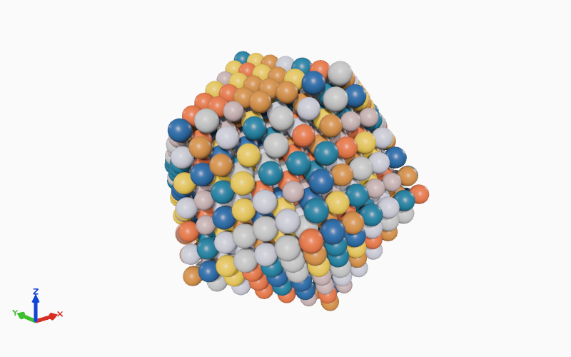
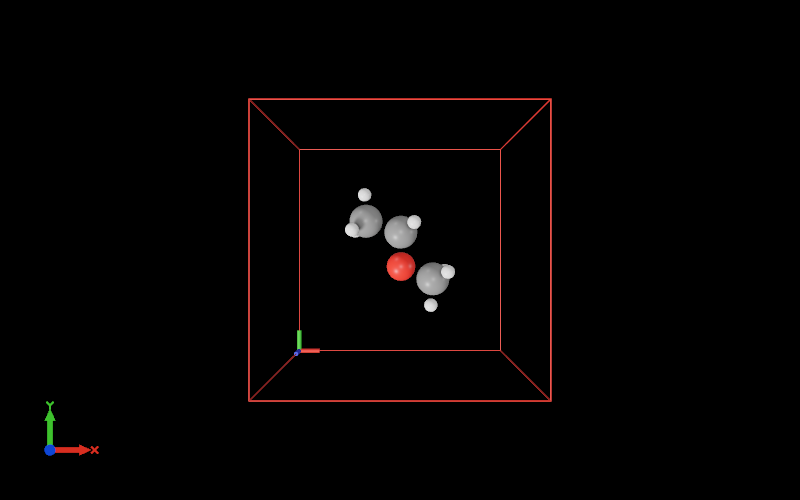
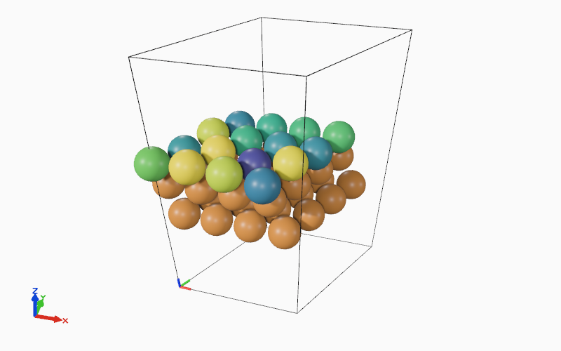
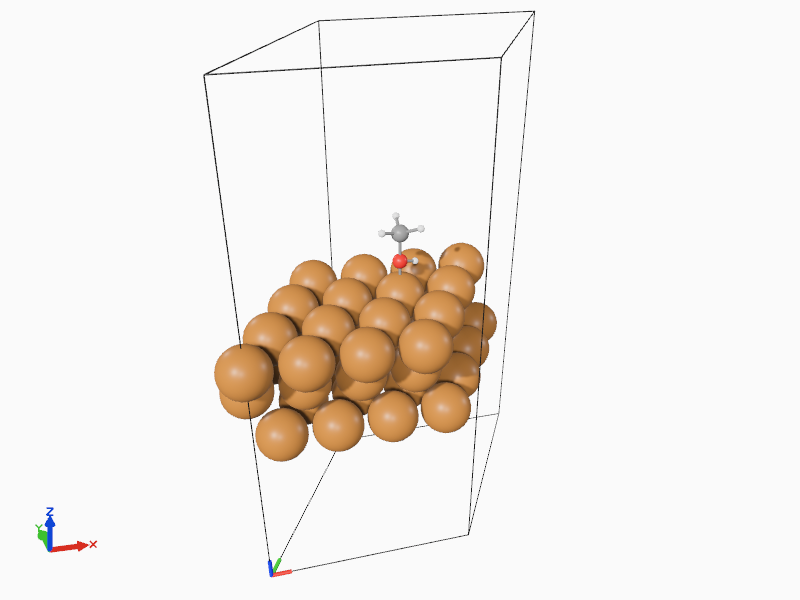

# atomic-kernels

`atomic-kernels` (`ak`) is a Rust-powered viewer and tooling stack for turning ASE atomistic structures into interactive, configurable visualizations across Python scripts, notebooks, and the web.

The current codebase combines:

- Rust crates for core geometry, visualization, and Python bindings
- A Python package built with `maturin`
- A WebAssembly build of the visualization tool. 
- ASE-oriented scripting workflows for customizing visualizations.

## Crates & Packages

The project consists of the following Rust crates 

- [`ak-core`](crates/ak-core/): Core structs used for atomic configurations/geometry. 
- [`ak-vis`](crates/ak-vis/): Defines the [Bevy](https://github.com/bevyengine/bevy)-backed viewer. 
- [`ak-py`](crates/ak-py/): Python bindings for `ak-core` and `ak-vis`, which is used by the `atomic-kernels` Python package. 
- [`ak-wasm`](crates/ak-wasm/): WebAssembly version of `ak-vis` to make the viewer embeddable on websites, slides and widgets.

In addition the project has two Python packages

- [`atomic-kernels`](packages/atomic-kernels/): Python side of `ak-py` with Python bindings to viewer and core functionality. 
- [`ak-widget`](packages/ak-widget/): `AnyWidget`-wrapper for the `ak-wasm` build that is intended to be useable in notebooks (Marimo/Jupyter) and Pyodide (JupyterLite etc.).

## Documentation

Find documentation here: [atomic-kernels.mads-peter.com/](https://atomic-kernels.mads-peter.com/)

## Examples

### Beautiful atoms

Everything rendered by the viewer is beautiful, no customization needed. 

### Configurable viewer

The viewer can be configured, for example a "dark-mode" viewer can be created.

### Property-based coloring

Select atom coloring based on computed properties (such as MLIP local energies), see [emt_relaxation_coloring.py](packages/atomic-kernels/scripts/emt_relaxation_coloring.py)

### Ball & Stick 

Switch between ball-stick & space-filling on a per-atom basis, see [slab_adsorbate_ball_and_stick.py](packages/atomic-kernels/scripts/slab_adsorbate_ball_and_stick.py)

## License

This project is licensed under the Apache License 2.0. See [`LICENSE`](LICENSE).
